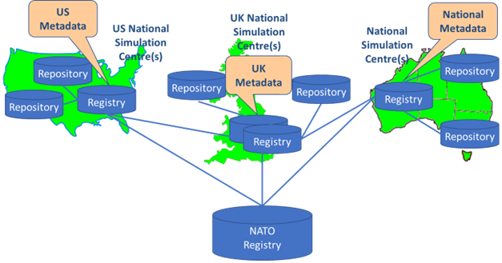
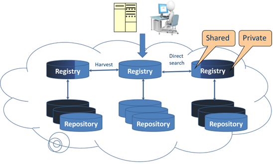
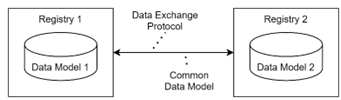

= Resource Discovery Specification (RDS)
:toc:
:sectnums:

== List of Acronyms

[cols="1,3"]
|===
|Abbreviation |Description

|DMS-MSR
|Discovery Metadata Specification for M&S Resources

|HTTP
|Hypertext Transfer Protocol

|JSON
|JavaScript Object Notation

|M&S
|Modelling and Simulation

|MSaaS
|M&S as a Service

|MSC-DMS
|M&S Community of Interest Discovery Metadata Specification

|NATO
|North Atlantic Treaty Organization

|NMSG
|NATO Modelling and Simulation Group

|RDS
|Resource Discovery Specification

|REST
|Representational State Transfer

|SISO
|Simulation Interoperability Standards Organization

|UID
|Unique Identifier
|===

== Nomenclature

The keywords “MUST”, “MUST NOT”, “REQUIRED”, “SHALL”, “SHALL NOT”, “SHOULD”, “SHOULD NOT”, “RECOMMENDED”, “MAY” and “OPTIONAL” in this document are to be interpreted as described in RFC 2119 and summarized below [1].

[cols="1,3"]
|===
|Term |Description

|MUST
|This word, or the terms "REQUIRED" or "SHALL", means that the definition is an absolute requirement of the specification.

|MUST NOT
|This phrase, or the phrase "SHALL NOT", means that the definition is an absolute prohibition of the specification.

|SHOULD
|This word, or the adjective "RECOMMENDED", means that there may exist valid reasons in particular circumstances to ignore a particular item, but the full implications must be understood and carefully weighed before choosing a different course.

|SHOULD NOT
|This phrase, or the phrase "NOT RECOMMENDED", means that there may exist valid reasons in particular circumstances when the particular behavior is acceptable or even useful, but the full implications should be understood and the case carefully weighed before implementing any behavior described with this label.

|MAY
|This word, or the adjective "OPTIONAL", means that an item is truly optional. One vendor may choose to include the item because a particular marketplace requires it or because the vendor feels that it enhances the product while another vendor may omit the same item. An implementation which does not include a particular option MUST be prepared to interoperate with another implementation which does include the option, though perhaps with reduced functionality. In the same vein an implementation which does include a particular option MUST be prepared to interoperate with another implementation which does not include the option (except, of course, for the feature the option provides).
|===

== Introduction

=== Background

A key idea of Modelling and Simulation as a Service (MSaaS) is the availability of MSaaS registries (also referred to as "MSaaS Portals") that hold information (metadata) about available M&S resources within an organization. Due to technical and regulatory limitations (e.g., export control laws), it is foreseen that multiple registries will be operated by the various nations and organizations that implement the _Allied Framework for MSaaS_ [2].

.Example illustration of distributed MSaaS registries [2].

Figure 1 illustrates the existence of multiple MSaaS registries and the desired information exchange. The key requirement is that a user has access to the information that is stored in connected remote registries. With respect to Figure 1 it is important to note the difference between _registry_ and _repository_:

* An MSaaS registry holds information (metadata) about M&S resources, such as M&S services, tools and datasets.
* An MSaaS repository hosts the actual M&S resources, such as M&S service implementations, terrain datasets and simulation tools.

This specification defines an information exchange protocol for exchanging information between federated MSaaS registries, i.e., for exchanging metadata about the actual M&S resources.

As illustrated in Figure 2, individual organizations may decide to share only a subset of the information of their respective MSaaS registry.

.Selective information sharing between MSaaS registries.

While Figure 1 illustrates the use case of federating registries of multiple nations, this use case could also apply to federating registries of multiple organizations within a single nation. The underlying setting and objective remain the same: Multiple stakeholders operate local registries (holding information about M&S resources that fall under their authority or ownership) and want to share some or all of their information (about their M&S resources) with other stakeholders for the greater objective of achieving situational awareness about existing M&S resources in the wider community of interest.

=== Intended use

This document specifies an information exchange protocol between federated MSaaS registries. The intended users are developers and providers of MSaaS registries.

== Scope and Requirements

=== Information Exchange Requirements

Figure 3 illustrates the two key elements required to establish information exchange between MSaaS registries: a common data exchange model (defining ‘what’ information is exchanged) and an agreed data exchange protocol (defining ‘how’ the information is exchanged).

.Common Data Model and Data Exchange Protocol are required.

=== Common Data Exchange Model

As the key objective of federated M&S registries is to connect registries from various stakeholders, proprietary data exchange models that are not available to all stakeholders are obviously not a viable option. To enable wide adoption by many stakeholders, openness and free availability of the common data exchange model is essential.

This specification allows the use of different date exchange models to exchange data between MSaaS registries. Specifically,

* A simplistic JSON data model (as defined in the accompanying JSON Schemas).
* Modeling and Simulation (M&S) Community of Interest (COI) Discovery Metadata Specification (MSC-DMS).
* Discovery Metadata Specification for M&S Resources (DMS-MSR). Note: This standard is currently under development by SISO.

Currently, MSC-DMS is considered the best option for describing M&S resources in terms of maturity of the standard and availability. Once development of DMS-MSR is completed and the standard is published, it is expected that DMS-MSR quickly takes over this role.

=== Use Case and Implementation Options

The following tasks serve as basic use cases:

1. A user browses registry A and wants to see all resources in registry B as well.
2. A user is logged in to registry A and wants to see all details about a specific resource from registry B.
3. A user executes a search in registry A and wants to get search results from registry B as well.

Various implementation options are possible that satisfy these use cases.

==== A-priori information replication

* Data from registry B is replicated in registry A, e.g. every night
* Pro:
** All data is available locally in registry A, no need for permanent connection
** Easy to implement, (delta)copy all data from registry B to registry A
* Con:
** Depending on the replication interval, data in registry A is not up-to-date
** Additional data storage requirements in registry A

==== On-demand information access

* Data is pulled from registry B on-demand, i.e. when needed
* Pro:
** User in registry A always has access to latest information in registry B
** No need for additional data storage in registry A
* Con:
** Permanent network connection required between registries A and B

==== Publish-Subscribe Mechanism

* Registry B can subscribe to specific resources in registry A (e.g., all resources or selected resources)
* Registry A notifies registry B about any changes to subscribed resources, so that registry B can update the relevant metadata
* Pro:
** Registries do not need to constantly pull other registries to have the latest information.
** Updates are propagated quickly
* Con:
** Registries need to keep track of subscriptions. Therefore, slightly increased development effort.

=== Non-functional Requirements

Any RDS implementation SHOULD use appropriate security mechanisms, especially proper authentication and authorization.

Details are currently under investigation and will be added in a later version.

As a minimum, authentication via username and password SHOULD be implemented and all communication SHOULD be transport-encrypted (e.g., using HTTPS or TLS).

== Protocol

=== Basics

RDS defines an HTTP-based REST interface for exchanging information about M&S resources (e.g., models, services, scenarios) between federated MSaaS registries. RDS also includes basic operations for manipulating resource metadata.

=== URL and path names

The full URL to access an RDS interface is composed of

 <server address>/<server-specific path>/<RDS specific path>

Example:

 <server address> = https://mydomain.com
 <server-specific path> = api
 <RDS specific path> = rds

Full URL would then be: `https://mydomain.com/api/rds`

For brevity, this specification usually omits the `<server address>` and `<server-specific path>`.

=== Operations

RDS defines operations for:

* retrieving registry information
* retrieving resource data
* manipulating resource data

Each of the following operations is described in detail in the following chapters.

[cols="1,2"]
|===
|Endpoint |Operation

|`GET /rds/v1/registry`
|Returns basic information about the registry itself.

|`GET /rds/v1/registry/index`
|Returns an index containing a list of all resources that are published by this registry.

|`POST /rds/v1/resources`
|Adds a new resource to the registry.

|`PUT /rds/v1/resources/\{resourceUid\}`
|Modifies an existing resource (as identified by its `resourceUid`).

|`GET /rds/v1/resources`
|Returns a list of all published resources with all details.

|`GET /rds/v1/resources/\{resourceUid\}`
|Returns a single resource (as identified by its `resourceUid`) with all details.

|`GET /rds/v1/resources/\{resourceUid\}/file`
|Returns a file attached to the specified resource (as identified by its `resourceUid`).

|`POST /rds/v1/resources/multi`
|Adds a new MSC-DMS multi-card resource.

_Note: This endpoint is experimental and not yet described in detail in this specification. Specification may change in future versions!_

|`GET /rds/v1/resources/search?q=+{query}+`
|Returns an MSC-DMS multi-card resource with all resources where resource title or description contains the `+{query}+` string.

_Note: This endpoint is experimental and not yet described in detail in this specification. Specification may change in future versions!_

|===

=== UIDs

Each MSaaS registry is responsible for assigning Unique Identifiers (UIDs) to all resources that are stored in that registry. Publicly used UIDs (e.g., as provided through RDS requests) MUST be permanent, i.e. they MUST NOT change. This is important as the UID is used as parameter in other requests, e.g., to retrieve metadata for a specific resource. It is recommended that each registry uses a specific (unique) prefix plus some sort of unique id.

* Example: `SRP-0001-0002-0003`
* Example: `OCEAN-98765`
* Example: `Horizon:1:1:248:9675`

=== Pagination

The current specification does not care about pagination. The registry will always provide all results for each endpoint (e.g., all resources). This works nicely for small numbers of resources, but not for 1,000 or 10,000 or even more resources. As of the time when this specification was developed this seems to be okay as just small numbers of resources are expected. If needed, pagination will be included in a later version of this specification.

== Generic error handling

The following error handling applies to *all* operations!

=== Return codes

[cols="1,1,1,1,2"]
|===
|HTTP status code |Meaning |RDS error code |Title  |Comment

| 400
| BAD_REQUEST
| ERR-002
| Invalid Request
| Missing authentication token, missing payload attributes or invalid payload. Other causes are mentioned for individual endpoints.

| 401
| UNAUTHORIZED
| ERR-001
| Access token is invalid
| Invalid or expired authorization token.

| 403
| FORBIDDEN
| ERR-003
| Forbidden
| User is not permitted to perform this action.

| 500
| INTERNAL SERVER ERROR
| ERR-100
| Internal server error
| In case of internal server error. Usually, a more specific message is not available.
|===

=== Bad request

If any part of the payload is invalid or the authorization header is missing, a JSON-encoded error object is returned with error code `ERR-002`.

 HTTP/1.1 400 Bad request
 Content-Type: application/json

The response attribute `details` contains the cause of the error.

 "details": "A request was invalid and caused the following error: <ERROR CAUSE>"

==== Example: Invalid JSON

A request with an invalid JSON payload will fail. The following request contains a JSON payload with a missing comma.

.Request:
----
{
   "name1": "value1"
   "name2": "value2"
}
----

.Response:
----
HTTP/1.1 400 Bad request
Content-Type: application/json

{
  "errors": [
    {
      "status":"400",
      "code":"ERR-002",
      "title":"Invalid Request",
      "details":"A request was invalid and caused the following error: Invalid JSON."
    }
  ]
}
----

==== Example: Missing required payload fields

In this example, the payload for creating a new resource does not contain all required attributes.

.Request:
----
{
   "coreInformation": {
      "description": "resourceType and name are MISSING!"
   },
   "additionalInformation": { ... }
}
----

.Response:
----
HTTP/1.1 400 Bad request
Content-Type: application/json

{
  "errors": [
    {
      "status":"400",
      "code":"ERR-002",
      "title":"Invalid Request",
      "details":"A request was invalid and caused the following error: Missing required fields coreInformation.resourceType, coreInformation.name."
    }
  ]
}
----

=== Missing permission

If a user is not allowed to perform an action, a JSON-encoded error object with error code `ERR-003` is returned.

==== Example

If a user does not have the permission for a specific operation (e.g., adding a resource) the request fails.

.Request:
----
POST /rds/v1/resources
Content-Type: application/json
   ...
----

.Response:
----
HTTP/1.1 403 Forbidden
Content-Type: application/json

{
   "errors": [
      {
         "status": "403",
         "code": "ERR-003",
         "title": "Forbidden.",
         "details": "User is not permitted to perform this action"
      }
   ]
}
----

=== Internal server error

Error code `ERR-100` indicates a server-side error, without necessarily providing more detailed information about the root cause of this error.

 HTTP/1.1 500 Internal Server Error
 Content-Type: application/json

==== Example

.Response:
----
HTTP/1.1 500 Internal Server Error
Content-Type: application/json

{
  errors: [
    {
      "status": "500",
      "code": "ERR-100",
      "title": "Internal server error",
      "details": "The server encountered an internal error."
    }
  ]
}
----

=== Multiple errors in JSON payload

If an endpoint expects a JSON payload and this payload contains multiple errors, the response errors array contains one error object for each of the detected errors.
In case that the errors would lead to different response status codes, 400 BAD REQUEST takes precedence over 404 NOT FOUND.

==== Example: Payload with two '400' errors

.Request:
----
POST /rds/v1/resources/
Content-Type: application/json

{
	"coreInformation": { ... },
    "additionalInformation": {
        "timeOfDay": "Day",
        "environment": "On a nice green lawn in June.",
        "tacticalSituation": "Urban assault",
        "approximatedDurationOfTraining": "10",
        ...
    },
    "scenarioConfiguration": { ... }

----

The payload above

* contains an invalid value for `additionalInformation.timeOfDay` (only "Daytime", "Nighttime" is allowed and *not* "Day"), and
*  does not contain the required attribute `additionalInformation.geographicalArea`.

.Response:
----
HTTP/1.1 400 Bad request
Content-Type: application/json

{
    "errors": [
        {
            "status": "400",
            "code": "ERR-002",
            "title": "Invalid Request",
            "details": "A request was invalid and caused the following error: Missing required field(s) additionalInformation.geographicalArea."
        },
        {
            "status": "400",
            "code": "ERR-002",
            "title": "Invalid Request",
            "details": "A request was invalid and caused the following error: Invalid value 'Day' for additionalInformation.timeOfDay."
        }
    ]
}
----

==== Example: Request with a '400' error and a '404' error

.Request:
----
PUT /rds/v1/resources/00000000-0000-0000-00000-0000000000
Content-Type: application/json

{
  "coreInformation": {},
  "scenarioConfiguration": {}
}
----

The payload is missing many required attributes and the specified `resourceUid` in the URL does not exist. In that case the error for the non-existing `resourceUid` is reported as it has a higher priority. The error for the missing attributes however is ignored.

.Response:
----
HTTP/1.1 400 Bad request
Content-Type: application/json

{
    "errors": [
        {
            "status": "404",
            "code": "RES-001",
            "title": "Resource not found",
            "details": "Specified uid doesn’t exist: 00000000-0000-0000-00000-0000000000"
        }
    ]
}
----

== Retrieve registry information

This operation returns basic information about the registry itself. Specifically, this includes:

* Supported RDS version
* Number of resources published by this registry

=== Request

 GET /rds/v1/registry

=== Return codes

[cols="1,1,1,1,2"]
|===
|Status |Meaning |Code |Title |Comment

|200 | OK | | | Successful operation

|===

=== Response

Returns a JSON object according to the registry information JSON schema that is provided in file link:registry-information.schema.json[registry-information.schema.json] (see  xref:json-schema-registry-information[xrefstyle=short]).

----
HTTP/1.1 200 OK
Content-Type: application/json

{
    "data": {
        "supportedVersion": "RDS-v1-D4",
        "nrOfResources": 123
    }
}
----

[#json-schema-registry-information]
=== JSON Schema (registry-information.schema.json)

[,json]
----
include::registry-information.schema.json[]
----

== Retrieve registry index

Returns an index with all resources provided by this registry as JSON. The registry index contains a list of all resources that are shared by this registry.

=== Request

 GET /rds/v1/registry/index

=== Return codes

[cols="1,1,1,1,2"]
|===
|Status |Meaning |Code |Title |Comment

|200 | OK | | | Successful operation
|===

=== Response

Returns a JSON object according to the registry index JSON schema that is provided in file link:registry-index.schema.json[registry-index.schema.json] (see  xref:json-schema-registry-index[xrefstyle=short])

----
HTTP/1.1 200 OK
Content-Type: application/json

Example response:
{
    "data": [
        {
            "name": "Weapon Effect Service",
            "uid": "registry-0123-abcd-6543"
        },
        {
            "name": "Weapon Effect Service",
            "uid": "atl-321-987"
        }
    ]
}
----

[#json-schema-registry-index]
=== JSON Schema (registry-index.schema.json)

[,json]
----
include::registry-index.schema.json[]
----

== Create new resource

This operation creates a new resource.

=== Request

 POST /rds/v1/resources/

This endpoint supports multiple content types:

[cols="1,2"]
|===
|Content-Type | Expected payload in request body

|application/json
|The request body must contain a JSON object that complies with the SDT JSON.

|application/vnd.msc-dms
|The request body must contain an XML file that complies with the MSC-DMS specification.

|===

=== Return codes

[cols="1,1,1,1,2"]
|===
|Status |Meaning |Code |Title |Comment

| 201
| CREATED
|
|
| Resource was created successfully.

| 400
| BAD_REQUEST
| ERR-002
| Invalid Request
| Missing required fields (resourceType, name, description, ...) or usage of forbidden fields, e.g., uid.

|===

=== Response (if successful)

Successful execution of the operation creates a new resource.

Specifically, the returned JSON object includes the identifier of the created resource (that can then be used in follow-on calls to modify it or get its details).

----
HTTP/1.1 201 CREATED
Content-Type: application/json

{
    "status" : "201",
    "title" : "Resource added.",
    "uid" : "9876-5432-1098,
    "details" : "New resource with id=9876-5432-1098 created."
}
----

=== Missing required fields

If any required fields are missing in the request payload, the resource is not created. A JSON-encoded error object is returned with error code `ERR-002`.

 HTTP/1.1 400 Bad request
 Content-Type: application/json

The response attribute `details` contains the cause of the error.

 "details": "A request was invalid and caused the following error: <ERROR CAUSE>"

The ERROR_CAUSE contains in this case a list of the missing fields.

 Missing required field(s) <field1>, <field2>.

==== Example

The following POST request to create a new resource fails as it does not contain the required fields:

* coreInformation.resourceType
* coreInformation.name

.Request:
----
POST /rds/v1/resources/
Content-Type: application/json

{
	"coreInformation": {
        "description": "The attributes resourceType and name are MISSING!"
    }
}
----

.Response:
----
HTTP/1.1 400 Bad request
Content-Type: application/json

{
  "errors": [
    {
      "status" : "400",
      "code" : "ERR-002",
      "title" : "Invalid Request",
      "details" : "A request was invalid and caused the following error: Missing required field(s) coreInformation.resourceType, coreInformation.name."
    }
  ]
}
----

=== Use of forbidden fields

If any fields are contained in the request payload that MUST NOT be sent, the resource is not created. A JSON-encoded error object is returned with error code `ERR-002`.

 HTTP/1.1 400 Bad request
 Content-Type: application/json

The response attribute `details` contains the cause of the error.

 "details": "A request was invalid and caused the following error: <ERROR CAUSE>"

The ERROR_CAUSE contains in this case a list of the forbidden fields.

==== Example

The following POST request to create a new resource fails as it contains the forbidden field:

* coreInformation.uid

.Request:
----
POST /rds/v1/resources/
Content-Type: application/json

{
   "coreInformation": {
      "resourceType" : "scenario",
      "name" : "Convoy Scenario",
      "description" : "This is a Convoy scenario with 3 units",
      "uid" : "REG-9876-5432-1234"
   }
----

.Response:
----
HTTP/1.1 400 Bad request
Content-Type: application/json

{
   "errors": [
      {
        "status" : "400",
        "code" : "ERR-002",
        "title" : "Invalid Request",
        "details" : "A request was invalid and caused the following error: The attribute uid is not allowed."
      }
   ]
}
----

== Modify an existing resource

This operation modifies an existing resource as specified by its `resourceUid`.

As this is a PUT endpoint, the specified resource will be completely replaced with the new representation provided in the request payload. In other words, all existing attribute values will be replaced with those in the payload.

=== Request

 PUT /rds/v1/resources/{resourceUid}
 Content-Type: application/json

=== Return codes

[cols="1,1,1,1,2"]
|===
|Status |Meaning |Code |Title |Comment

| 200
| OK
|
|
| Resource was modified successfully.

| 400
| BAD_REQUEST
| ERR-002
| Invalid Request
| Usage of forbidden field, e.g., uid.

|===

==== Request JSON payload

The request payload is the same as with the POST endpoint to create a new resource:

* required and optional attributes are the same
* JSON Schema is the same

=== Response (if successful)
Successful execution of the operation modifies an existing resource. Specifically, the returned JSON object includes the identifier of the modified resource.

----
HTTP/1.1 200 OK
Content-Type: application/json

{
    "status" : "200",
    "title" : "Resource modified.",
    "uid" : "9876-5432-1098,
    "details" : "Resource with id=9876-5432-1098 was modified."
}
----

The error behavior is also the same as for the POST endpoint to create a new resource.

== Get a list of all existing resources

This operation returns a list of all resources.

=== Request

 GET /rds/v1/resources
 Content-Type: ...

RDS supports different content types, i.e., the result can be delivered in a variety of formats. The client MUST specify the desired format in its request, by defining an appropriate Content-Type in the HTTP request header.

Valid options are:

|===
|Content-Type |Format of result

|application/json
|Result will be provided as Service Description Template (SDT) in JSON format. See `sdt-json.adoc` for more details. All registries MUST offer this option.

|application/vnd.msc-dms
|Result will be provided as MSC-DMS compliant XML file. OPTIONAL.

|===

=== Return codes

[cols="1,1,1,1,2"]
|===
|Status |Meaning |Code |Title |Comment

| 200
| OK
|
|
| Successful operation

|===

=== Response (if successful)

Successful execution of the operation returns a list of all resources published by this registry. All metadata information is included.

----
HTTP/1.1 200 OK
Content-Type: application/json

"resources": [
    {
        "coreInformation": {
            "name": "Convoy Scenario-1-2023-05-02T08:08:50.076884900",
            "uid": "64afd7ab-36b0-4f9b-a3b8-4c5e4de7079d",
            "description": "This is a Convoy scenario with 3 units",
            "owner": "David the Scenario Creator",
            "version": "2.0.1",
            "icon": "iVBORw0KGgoAAAANSUhEUgAAAgAAAAIACAYAAA...",
            "resourceType": "scenario",
            "url": "https://registry.local/extern/registry-0123-abcd-6543"
        },
        "deploymentInformation": {
        }
    },
    {
        "coreInformation": {
            ...
        }
    },
    ...
}
----

[[chapter_get_single_resource]]
== Get details of a single resource

Successful execution of the operation returns the details of a single resource identified by its resource uid.

=== Request

 GET /rds/v1/resources/{uid}

RDS supports different content types, i.e., the result can be delivered in a variety of formats. The client MUST specify the desired format in its request, by defining an appropriate Content-Type in the HTTP request header.

Valid options are:

|===
|Content-Type |Format of result

|application/json
|Result will be provided as Service Description Template (SDT) in JSON format. See `sdt-json.adoc` for more details. All registries MUST offer this option.

|application/vnd.msc-dms
|Result will be provided as MSC-DMS compliant XML file. OPTIONAL.

|===

=== Return codes

[cols="1,1,1,1,2"]
|===
|Status |Meaning |Code |Title |Comment

| 200
| OK
|
|
| Successful operation.

| 404
| NOT FOUND
| RES-001
| Resource not found
| Specified resource uid not found.
|===

=== Response (if successful)
Successful execution of the operation returns a single resource with all details in the payload.

----
HTTP/1.1 200 OK
Content-Type: application/json
----

== Get file of a resource

Successful execution of the operation returns a file (e.g., a 3-d model) attached to the specified resource.

#*Note: This is an experimental functionality and is very likely to change in the future.*#

=== Request

 GET /rds/v1/resources/{uid}/file

=== Return codes

[cols="1,1,1,1,2"]
|===
|Status |Meaning |Code |Title |Comment

| 200
| OK
|
|
| Successful operation.

| 404
| NOT FOUND
| RES-001
| Resource not found
| Specified resource uid not found.
|===

=== Response (if successful)
Successful execution of the operation, i.e., specified uid exists and a file is attached to this resource, returns a binary file.

----
HTTP/1.1 200 OK
Content-Type: application/octet-stream
----

== Bibliography

[1] "Request for Comments: 2119", Network Working Group, Harvard University, 1997.

[2] "Operational Concept Document (OCD) for the Allied Framework for M&S as a Service", NATO STO, 2019. STO-TR-MSG-136-Part-III. NATO Science & Technology Organization, Neuilly-sur-Seine, France.